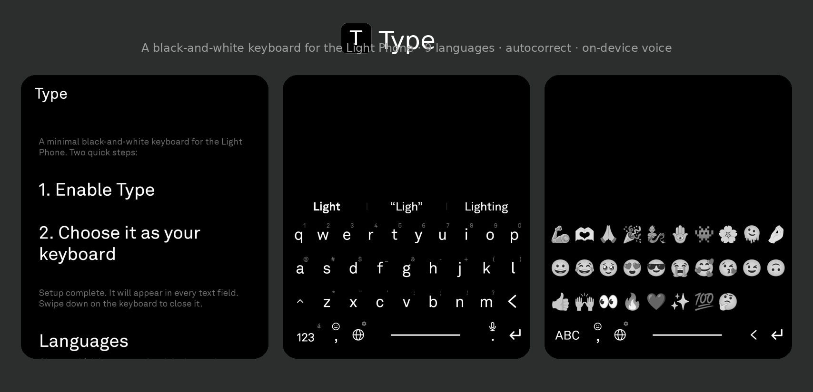

A clone of the Light Phone 3's built-in keyboard, for any app.

On a stock Light Phone, the black-and-white keyboard lives inside Light's own tools. Other apps use the
system keyboard, and there is no Light one to choose. This is a faithful recreation, packaged as a
system keyboard you can set as the default, so every app on a modified Light Phone shares the same look.

Optional autocorrect and optional voice dictation. Swipe down on the keyboard to hide it.

**Multiple languages.** Choose which languages the globe key cycles through in **Settings → Languages**:
English, Hebrew, Spanish, French, German, Italian, Portuguese (each with its own layout and long-press
accents). The emoji key opens emoji.

- **English** — QWERTY, offline autocorrect (Vosk voice), learns your words.
- **Hebrew** — Standard Israeli layout (finals included), offline autocorrect, learns your words; voice
  via the phone's own service (`he-IL`).
- **Spanish / French / German / Italian / Portuguese** — full typing with their layouts (QWERTY, AZERTY,
  QWERTZ) and accents on the 123-key long-press. Offline autocorrect for these is an optional download
  (~0.6 MB each) from **Settings → Languages**, after which it learns your words like English and Hebrew.

## Install

### With [Obtainium](https://github.com/ImranR98/Obtainium), which keeps you up to date

1. Install Obtainium.
2. Add an app, and give it this repository:
   `https://github.com/KEZO555/light-keyboard`
3. It installs the latest release, and tells you when there is a new one.

### Or by hand

Download the latest APK from [Releases](../../releases) and open it.

## Turn it on

Open Type. The setup screen holds everything:

1. **Enable Type**: opens Android's keyboard settings, where you switch it on.
2. **Choose it as your keyboard**: makes it the active one.

The settings below it:

- **Languages**: choose which languages the globe key (bottom row) cycles through; the emoji key opens
  emoji. English and Hebrew ship with offline autocorrect built in; Spanish, French, German, Italian and
  Portuguese each offer an optional dictionary download right on this screen. Hebrew is caseless, so it
  has no shift key — just the 27 letter forms in the standard Israeli arrangement.
- **Autocorrect** (on by default): fixes misspellings as you type, using bundled English and Hebrew
  frequency dictionaries that also learn the words you use. Keyboard-aware (it prefers fixes that are a
  neighbouring-key slip or a swapped pair) and conservative, so it doesn't replace words you meant.
  Fully offline. Turn it off to type exactly what you tap. **It learns your vocabulary** (English and
  Hebrew): an unfamiliar word with no near match is kept the first time; one that looks like a typo is
  offered as a correction once, but the second time you type it the keyboard trusts it — adds it to your
  vocabulary and stops correcting it. Rejecting a correction (backspace) also teaches it your word.
- **Auto-capitalize** (on by default): capitalize the first letter of each sentence.
- **Double-space for period** (on by default): tap space twice to insert `. `.
- **Haptic feedback**: cycle Off / Light / Medium / Strong; tapping previews the strength.
- **Key-press sound** (off by default): the system click on each key, at your device's sound-effect volume.
- **Long-press delay**: Slow / Normal / Fast — how long to hold a key before its symbol/accents appear.
- **Cursor swipe**: Low / Normal / High — how far you slide on the space bar to move the caret one step.
- **Keyboard height**: Compact / Normal / Tall.
- **Number row** (off by default): a persistent row of digits above the letters.
- **Emoji**: tap a grid of candidate emoji to choose which ones appear in the keyboard's emoji panel
  (recently-used still float to the front).
- **Voice dictation** (off by default): turning it on downloads the ~40 MB offline English model once,
  then a mic key lets you speak instead of type. English runs entirely on-device; Hebrew dictation uses
  the phone's own voice service. Once downloaded, a **Delete voice model** button appears to reclaim the
  space.

That is the whole setup.

## Gestures

- **Globe** (marked with a small ⚙) — tap switches English ⇄ Hebrew; **long-press opens a quick-settings
  panel** right on the keyboard (haptic strength, autocorrect, auto-capitalize, double-space, number row,
  plus a shortcut to the full settings) — no need to leave the app you're typing in. **Comma key** —
  tap types a comma; **long-press opens the emoji panel** (recently-used float to the front).
- **Long-press a letter** — pops up its corner number/symbol (selected by default); release to type it,
  or slide off the key to cancel and keep the letter.
- **Long-press the `123`/`ABC` key** (marked with `◌ָ` in Hebrew, `á` in English) — a picker of vowel
  points (Hebrew) / accented letters (English).
- **Long-press the period** — starts voice dictation (English only; Hebrew dictation needs a system
  recognizer most Light Phones don't have).
- **Double-tap space** — inserts `. ` (sentence end).
- **Drag the space bar** — moves the cursor like an iPhone trackpad: left/right by character, up/down
  by line.
- **Long-press the `123`/`ABC` key** — opens an edit menu: select all · copy · cut · paste.
- **Hold backspace** — repeats, then deletes whole words after a longer hold.
- **Enter** — inserts a newline (or submits in Go/Search/Send/Next fields); it no longer closes the
  keyboard. **Long-press Enter** — hides the keyboard.
- **Swipe down** — hides the keyboard.

Haptics are light and crisp (short, low-amplitude), tuned to feel close to the iPhone keyboard, and
respect the device's haptic-feedback setting.

Hebrew also snaps a letter to its **final form** at the end of a word automatically (e.g. typing מ as
the last letter becomes ם), and back when the word continues.

## Build it yourself

```sh
./gradlew :app:assembleDebug      # debug build
./gradlew :app:assembleRelease    # release build (unsigned unless signing env vars are set)
```

Needs JDK 17 and the Android SDK (API 35). Tagged releases (`v*`) are built and signed by
[`.github/workflows/release.yml`](.github/workflows/release.yml). The English typing model in
`app/src/main/res/raw/charmodel.bin` is regenerated by [`tools/gen_charmodel.py`](tools/gen_charmodel.py).
The Hebrew typing model (`app/src/main/res/raw/hebcharmodel.bin`) and the bundled Hebrew dictionary
(`app/src/main/assets/he_words.txt`) are regenerated by [`tools/gen_hebrew.py`](tools/gen_hebrew.py)
from a `word<space>frequency` list (e.g. the Hebrew list from
[hermitdave/FrequencyWords](https://github.com/hermitdave/FrequencyWords)). The English prediction list
(`app/src/main/assets/en_words.txt`) is built by [`tools/gen_english.py`](tools/gen_english.py) from a
frequency list such as [Norvig's count_1w.txt](https://norvig.com/ngrams/count_1w.txt).

## Releasing

Pushing a version tag triggers [`.github/workflows/release.yml`](.github/workflows/release.yml), which
builds, signs, and attaches the APK to a GitHub Release (Obtainium reads that).

One-time setup: create a signing keystore — keep it safe, losing it breaks future updates; it is
gitignored — then store it as repo secrets.

```sh
# Generate the keystore (prompts for a password and a name; the key password can match the store one)
keytool -genkeypair -v -keystore release.jks -alias lightkb \
    -keyalg RSA -keysize 2048 -validity 10000

# Copy its base64 for the KEYSTORE_BASE64 secret (macOS)
base64 -i release.jks | pbcopy
```

Add four secrets under **Settings → Secrets and variables → Actions**: `KEYSTORE_BASE64` (the value
just copied), `KEYSTORE_PASSWORD`, `KEY_ALIAS` (`lightkb`), and `KEY_PASSWORD`.

Then for each release, bump `versionCode`/`versionName` in `app/build.gradle` and push a tag:

```sh
git tag v0.1.0 && git push origin v0.1.0
```

## A note

This is an independent, open-source project. It is made for the Light Phone, but it is not made by Light.

## License

[MIT](LICENSE). Do what you like with it.
